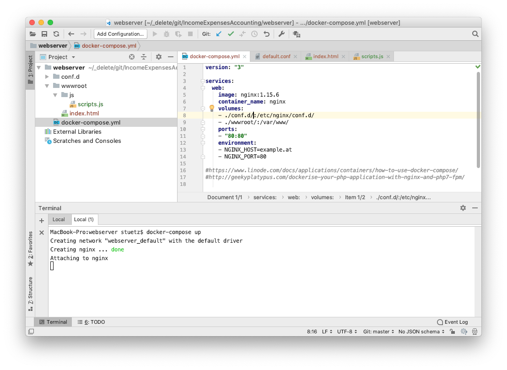
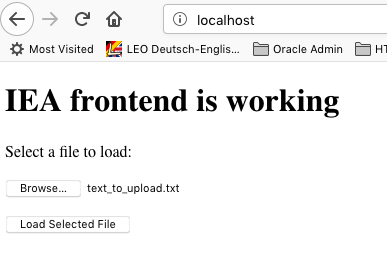
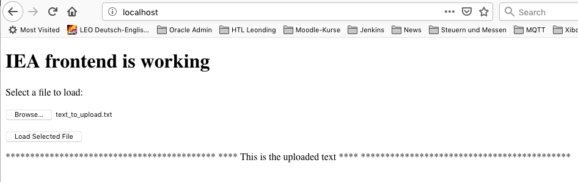
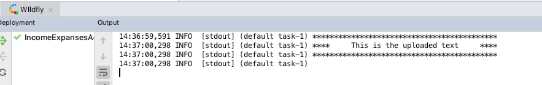

# IncomeExpensesAccounting
- Michael Frech
- Julian Nobis
- Lukas Stransky


## Inbetriebnahme des Prototypen

### JEE-Server starten

### Docker-Container NGINX starten

- Docker starten
- Webstorm starten
- Im webserver-Ordner befindet sich das Projekt
- docker-compose starten: Dazu ein Terminal-Fenster öffnen und `docker-compose up` eingeben. Wichtig. Man muss sich im Verzeichnis mit `docker-compse.yml` befinden.



- Im Verzeichnis wwwroot befinden sich die HTML/JS/CSS-Dateien

### Seite im Browser öffnen

- Im Browser `localhost:80` eingeben



- Mit Button Browse ein File auswählen
- Button "Load Selected File" anklicken
- Nun wird der Inhalt des Files auf der Website ausgegeben



- Gleichzeitig wird der empfangene Content am JEE-Server im Log ausgegeben:



## Beenden des Prototype

Der nginx-Webserver wird mit 

```
docker-compose down
```

wieder beendet.